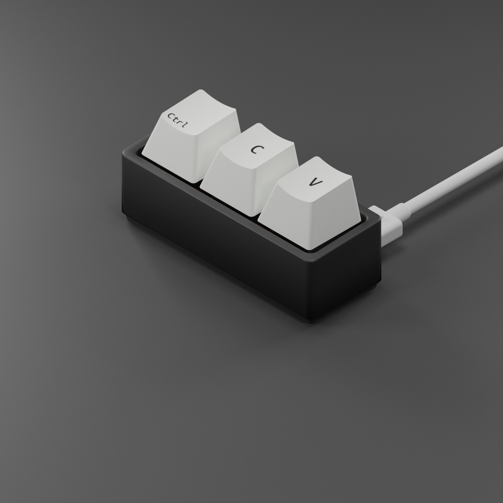
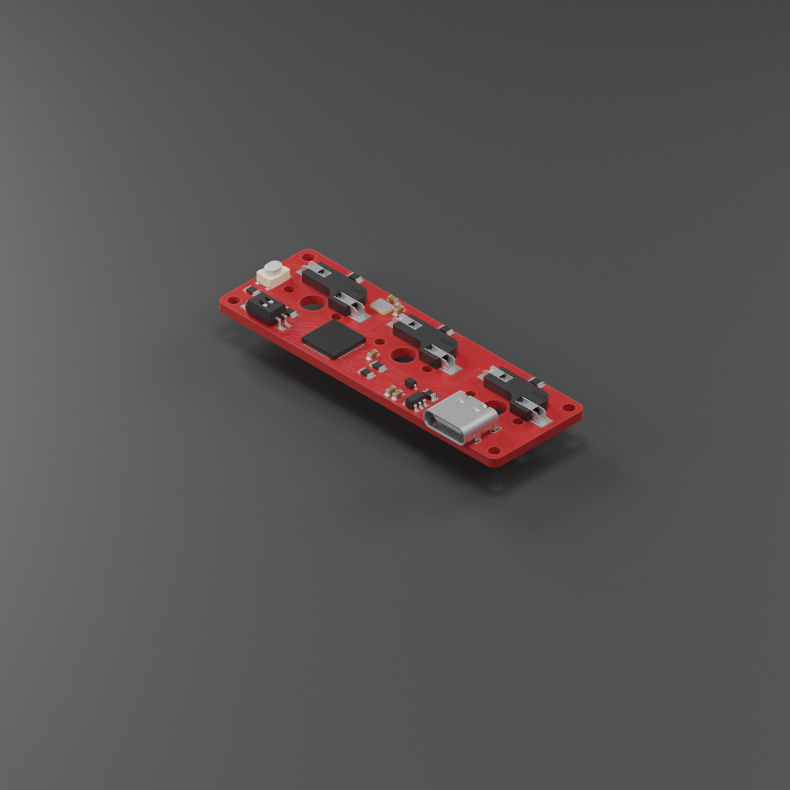
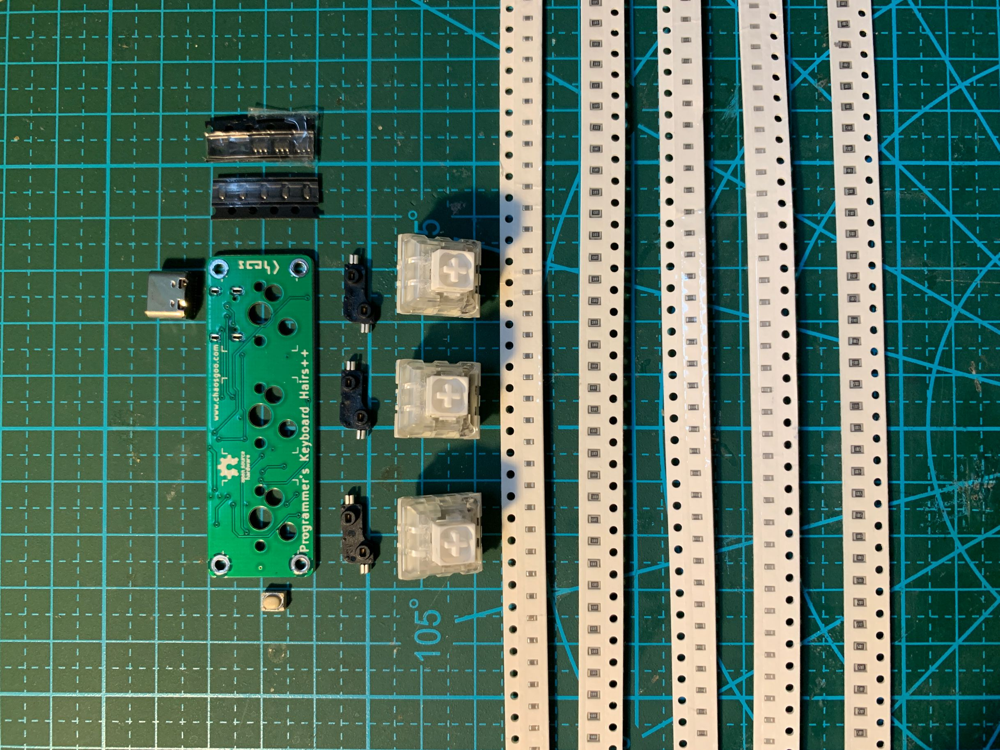

# HairsPP

Languages: [中文](README.md),English

[HairsPP](https://github.com/chaosgoo/HairsPP) means Hairs Plus Plus. [HairsPP](https://github.com/chaosgoo/HairsPP) is 3-key keyboard.
* Hot-swap
* Repeater Mode
* Simple source code
* customize key mapping

## TODO
* ~~20210412:PCB~~ 
* ~~20210418:Source Code beta version~~ 
* Shell
* Software on PC

## NOTICE
status(5,6) | Name |Description 
:-:|:-:|:-:
00 | Preferences Mode | Mapping keys by sending 3 bytes to keyboard
10 | Repeater Mode | Repeater Mode
01 | Reset | Valid before power on
11 | Normal Mode | Just like a normal keyboard

## BOM

No. | Name | Piece | Annotation
-|-|-|-
1|ATMega32u4 | 1 | MCU QFN44
2|AP2112K-3.3 | 1 | 5V->3.3V SOT-23-5
3|16Mhz Crystal | 1 | 2.0mm*1.6mm
4|1uF Capacity | 1 | 0603
5|22pf Capacity | 2 | 0603
6|10uf Capacity | 2 | 0603
7|1KΩ Resistance | 5 | 0805
8|10KΩ Resistance | 1 | 0805
9|22Ω Resistance | 2 | 0805
10|Kailh hot-swap switch sockets | 3 | 1511 Serial
11|Switch | 3 | MX Switch
12|2-bit Dip Switch | 1 | 1.27mm
13|Type-C plug | 1 | 16p
14|Diode| 1 | BAT60JFILM SOD-323
15|Button | 1 | 3mmx4mmx2.5mm SMD Button
